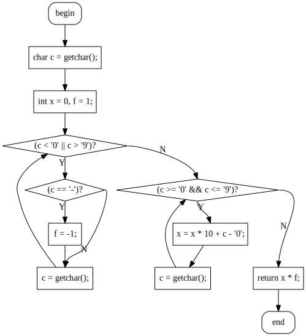

# cxx2flow

[简体中文](README.md) | [English](README-en.md)

Turn your C/C++ code into flowchart

## Demo

For more demo please refer to [GALLERY](gallery.md)

Two different styles：
| | |
|:-:|:-:|
| polyline | smooth |
|||

```cpp
inline int read() {  //快读
  char c = getchar();
  int x = 0, f = 1;
  while (c < '0' || c > '9') {
    if (c == '-') f = -1;
    c = getchar();
  }
  while (c >= '0' && c <= '9') {
    x = x * 10 + c - '0';
    c = getchar();
  }
  return x * f;
}
```

### Error reporting


## Installation

### Compile from source

```bash
cargo install cxx2flow
```

### Prebuilt binary

It is recommended to download prebuilt binary from [Github Release](https://github.com/Enter-tainer/cxx2flow/releases).

### GUI version

For those who are not familiar with command line, I recommend the GUI version of cxx2flow. https://github.com/Enter-tainer/cxx2flow-gui/releases


## Usage

To compile the generated dot file, you need graphviz. You can also copy the output to online graphviz services such as http://magjac.com/graphviz-visual-editor/ .

```
Convert your C/C++ code to control flow chart

Usage: cxx2flow [OPTIONS] [INPUT] [FUNCTION]

Arguments:
  [INPUT]     Sets the path of the input file. e.g. test.cpp
              If not specified, cxx2flow will read from stdin.
  [FUNCTION]  The function you want to convert. e.g. main [default: main]

Options:
  -o, --output <OUTPUT>  Sets the output file.
                         If not specified, result will be directed to stdout.
                         e.g. graph.dot
  -c, --curly            Sets the style of the flow chart.
                         If specified, output flow chart will have curly connection line.
      --cpp              Use C preprocessor.
  -t, --tikz             Use tikz backend.
  -d, --dump-ast         Dump AST(For debug purpose only).
  -h, --help             Print help information
  -V, --version          Print version information

Note that you need to manually compile the dot file using graphviz to get SVG or PNG files.

EXAMPLES:
    cat main.cpp | cxx2flow | dot -Tsvg -o test.svg
    cxx2flow test.cpp | dot -Tpng -o test.png
    cxx2flow main.cpp my_custom_func | dot -Tsvg -o test.svg

Please give me star if this application helps you!
如果这个应用有帮助到你，请给我点一个 star！
https://github.com/Enter-tainer/cxx2flow
```

## Limitations

- The support of preprocessor is based on `cpp`, and is disabled by default. `--cpp` flag is needed to enable it. It will fail if `cpp` does not exist in `PATH`.
- Supported control flow keyword: while，for，if，break，continue，break，return，switch, goto, do-while。
- Very basic support for range based loop in C++ 11.

## WebAssembly (browser / Node.js)

`cxx2flow` now provides a wasm entrypoint `generate_dot(content, function_name, curly)` for browser usage.

Build wasm package:

```bash
CC_wasm32_unknown_unknown="$PWD/scripts/clang-wasm.sh" wasm-pack build --target web --release
```

Or use `just` (auto-detect OS):

```bash
just wasm-build
```

Windows (PowerShell):

```bash
$env:CC_wasm32_unknown_unknown = (Resolve-Path scripts/clang-wasm.cmd).Path
wasm-pack build --target web --release
```

Run minimal smoke test in Node.js:

```bash
node scripts/wasm-smoke.mjs
```

With `just`:

```bash
just wasm-smoke
```

Notes:

- Browser/wasm mode only exposes DOT backend via `generate_dot`.
- CLI-only features (like `--cpp` and AST dump coloring output) are native-mode only.
- `.cargo/config.toml` is intentionally not used for wasm toolchain wiring; set `CC_wasm32_unknown_unknown` explicitly per shell/session.
