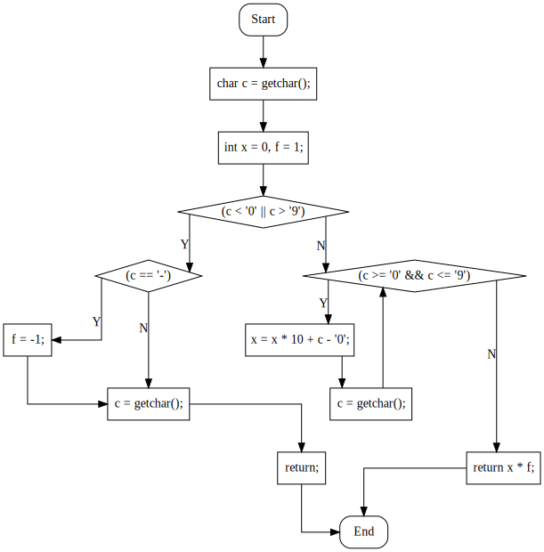

# cxx2flow

将 C/C++ 代码转换为流程图

## 效果

<div style="text-align:center;"></div>

## 安装

### 自行编译

```bash
cargo install cxx2flow
```

### 下载预构建二进制

可以到 [GitHub Actions](https://github.com/Enter-tainer/cxx2flow/actions) 下载最新构建的二进制，包含 Linux 和 Windows 版本。

## 使用

为了编译生成的 dot 文件，你需要安装 graphviz，并将其添加到 PATH 中。也可以将生成的结果复制进在线的 graphviz 服务中，如 http://viz-js.com/ 。

```
cxx2flow 0.1.3
mgt. <mgt@oi-wiki.org>
Convert your C/C++ code to control flow chart

USAGE:
    cxx2flow [FLAGS] [OPTIONS] <INPUT> [FUNCTION]

FLAGS:
    -c, --curved     Sets the style of the flow chart.
                     If specified, output flow chart will have curved connection line.
    -h, --help       Prints help information
    -V, --version    Prints version information

OPTIONS:
    -o, --output <OUTPUT>    Sets the output file.
                             If not specified, result will be directed to stdout.
                             e.g. graph.dot

ARGS:
    <INPUT>       Sets the input file. e.g. test.cpp
    <FUNCTION>    The function you want to convert. e.g. main

Note that you need to manually compile the dot file using graphviz to get SVG or PNG files.
EXAMPLES:
    cxx2flow test.cpp | dot -Tpng -o test.png
    cxx2flow main.cpp my_custom_func | dot -Tsvg -o test.svg
```

## 限制

- 暂时不支持 do-while，switch 和 goto
- 支持的控制流语句有：while，for，if，break，continue，break，return。