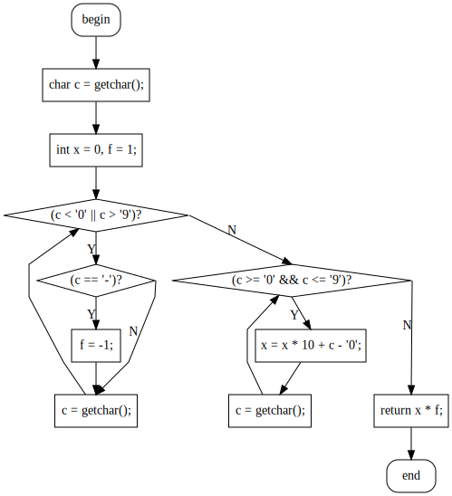

# cxx2flow

[简体中文](README.md) | [English](README-en.md)

将 C/C++ 代码转换为流程图

## 效果

更多效果图请参考 [GALLERY](gallery.md)

两种样式：
| | |
|:-:|:-:|
| 折线 | 平滑 |
|||

```cpp
inline int read() {  //快读
  char c = getchar();
  int x = 0, f = 1;
  while (c < '0' || c > '9') {
    if (c == '-') f = -1;
    c = getchar();
  }
  while (c >= '0' && c <= '9') {
    x = x * 10 + c - '0';
    c = getchar();
  }
  return x * f;
}
```

### 错误报告


## 安装

### 自行编译

```bash
cargo install cxx2flow
```

### 下载预构建二进制

推荐从右侧的 [Github Release](https://github.com/Enter-tainer/cxx2flow/releases) 下载对应平台的二进制文件。

也可以到 [GitHub Actions](https://github.com/Enter-tainer/cxx2flow/actions?query=branch%3Amaster+is%3Asuccess+event%3Apush+actor%3AEnter-tainer) 或 [Nightly.link](https://nightly.link/Enter-tainer/cxx2flow/workflows/build/master) 下载最新构建的二进制，包含 Linux, Windows 和 MacOS 版本。

### 使用 GUI 版本

对于没有命令行使用经验的用户，推荐下载使用基于 tauri 编写的 GUI 版本。 https://github.com/Enter-tainer/cxx2flow-gui/releases


## 使用

为了编译生成的 dot 文件，你需要安装 graphviz，并将其添加到 PATH 中。也可以将生成的结果复制进在线的 graphviz 服务中，如 http://magjac.com/graphviz-visual-editor/ 。

```
cxx2flow 0.5.9
mgt <mgt@oi-wiki.org>
Convert your C/C++ code to control flow chart

USAGE:
    cxx2flow [OPTIONS] [ARGS]

ARGS:
    <INPUT>       Sets the path of the input file. e.g. test.cpp
                  If not specified, cxx2flow will read from stdin.
    <FUNCTION>    The function you want to convert. e.g. main [default: main]

OPTIONS:
    -c, --curly              Sets the style of the flow chart.
                             If specified, output flow chart will have curly connection line.
        --cpp                Use C preprocessor.
    -h, --help               Print help information
    -o, --output <OUTPUT>    Sets the output file.
                             If not specified, result will be directed to stdout.
                             e.g. graph.dot
    -t, --tikz               Use tikz backend.
    -V, --version            Print version information

Note that you need to manually compile the dot file using graphviz to get SVG or PNG files.

EXAMPLES:
    cat main.cpp | cxx2flow | dot -Tsvg -o test.svg
    cxx2flow test.cpp | dot -Tpng -o test.png
    cxx2flow main.cpp my_custom_func | dot -Tsvg -o test.svg

Please give me star if this application helps you!
如果这个应用有帮助到你，请给我点一个 star！
https://github.com/Enter-tainer/cxx2flow
```

## 限制

- 对于预处理器的支持基于 `cpp` ，默认关闭，需要使用 `--cpp` 参数手动启用。如果 `PATH` 中不存在 `cpp` 则会失败。
- 支持的控制流语句有：while，for，if，break，continue，break，return，switch, goto, do-while。
